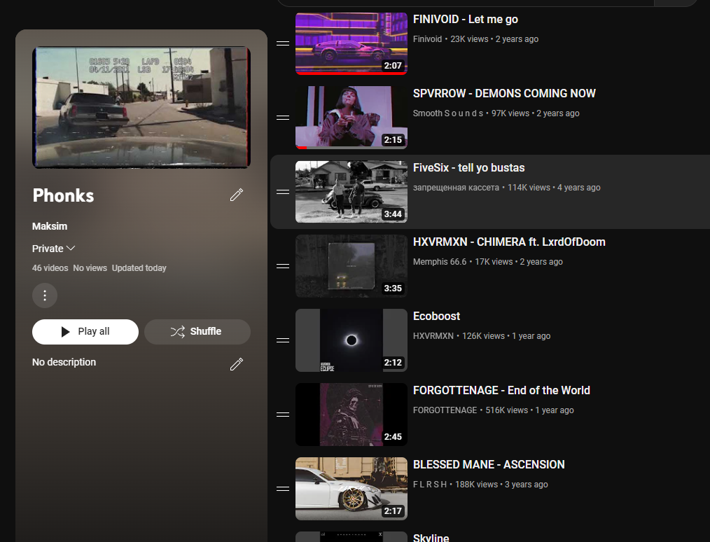

# Поиск музыки на ютубе по названию

### Что делается
- для каждого названия фонка из файла производится поиск в ютубе  
- берется первое видео из предложенного списка
- название и ссылка на видео сохраняется в файл
- с помощью YouTube API видео сохраняются в заранее созданный плейлист

### Несколько строк из файла с названями  
  

### Несколько строк из результируещего файла
  

### Результат перехода по одной из ссылок
  

### Результат добавления в плейлист (YouTube api)
  
